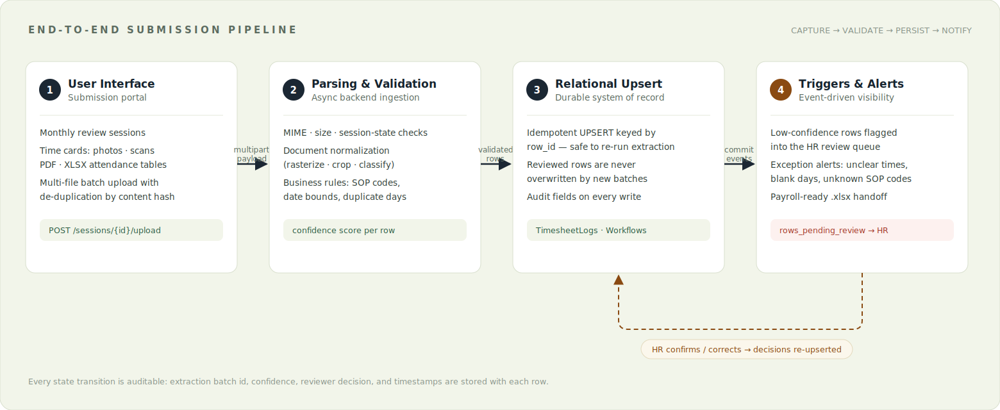
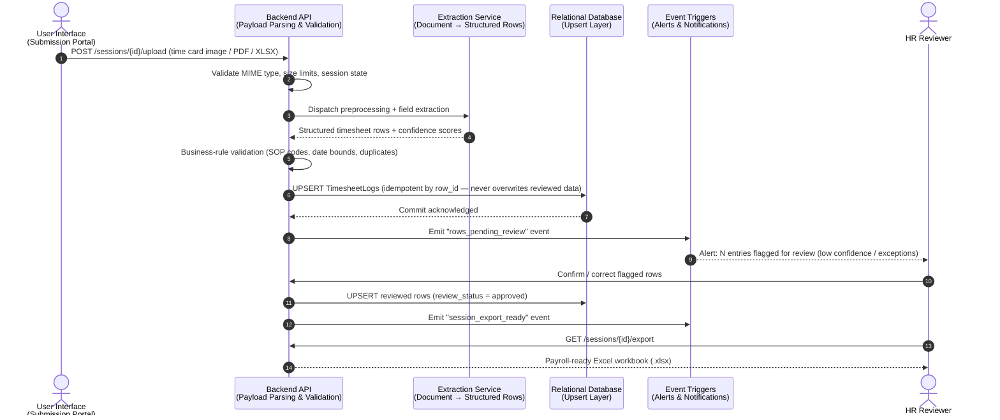
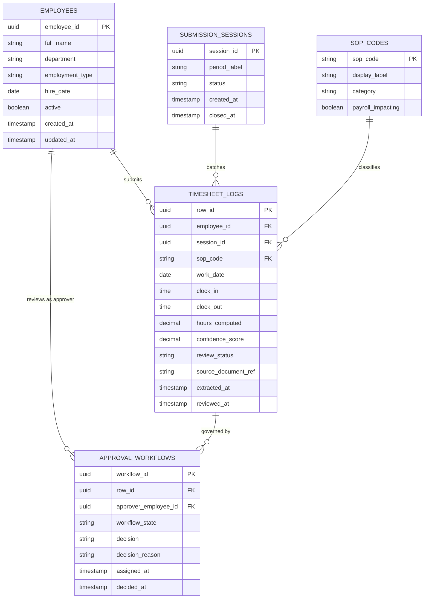
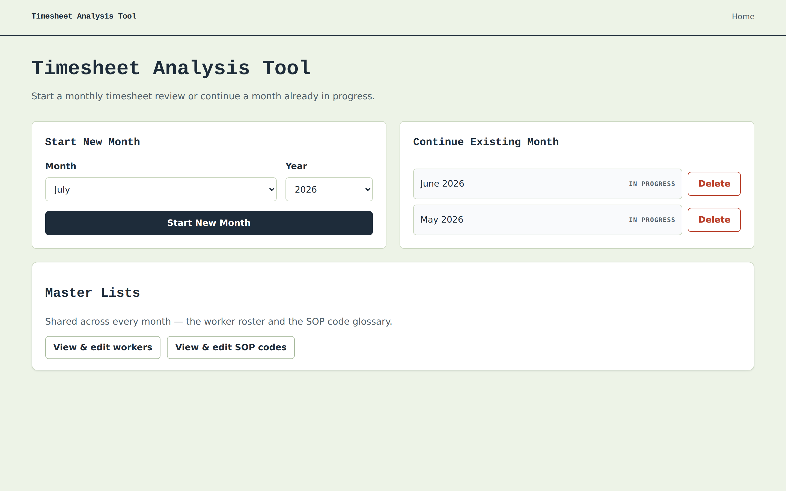
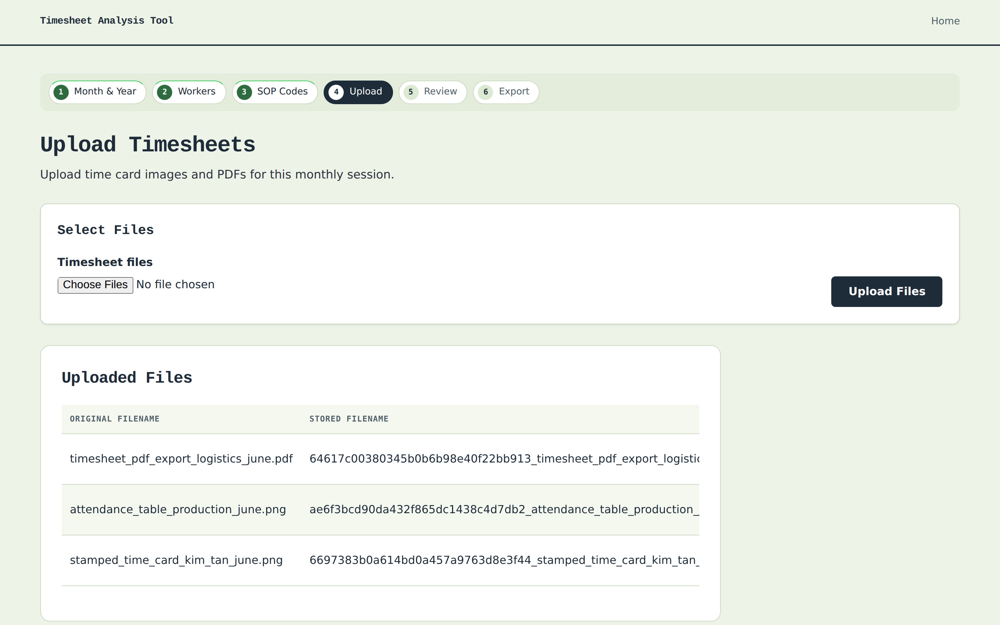
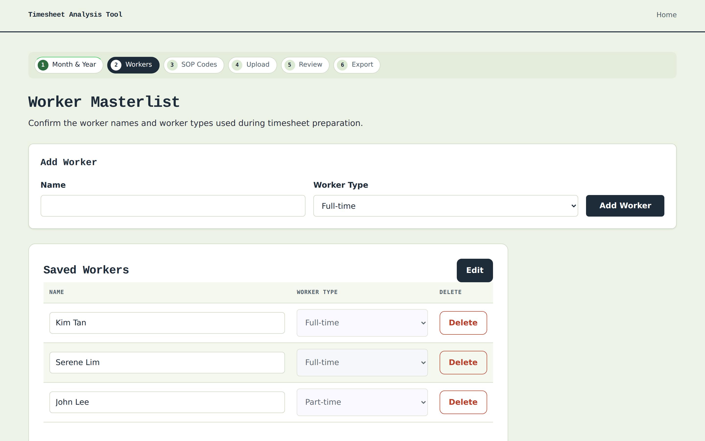
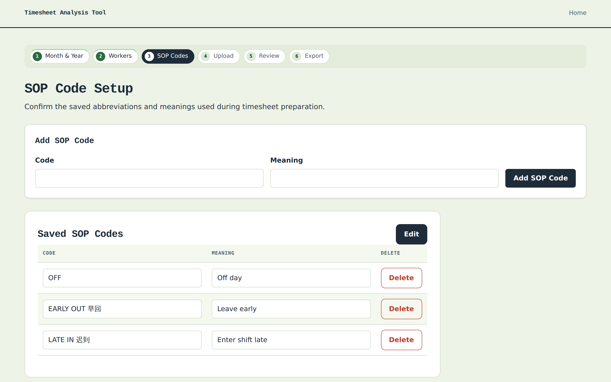

# HR Timesheet Tool — Enterprise Workforce Time-Capture Blueprint

<!-- Badges: replace placeholder targets with your CI/CD and registry URLs -->
[](#)
[](#)
[](#)
[](#)
[](#)

---

## Executive Problem Statement

Manual workforce time tracking — paper time cards, ad-hoc spreadsheets, and email-based approvals — introduces transcription errors, payroll disputes, and multi-day processing bottlenecks that scale linearly with headcount. This system replaces that fragmented process with an automated, high-visibility capture-to-payroll workflow: structured ingestion of employee time submissions, deterministic validation and exception surfacing, and export of payroll-ready output in minutes rather than days. The result is a measurable reduction in payroll cycle time, an auditable review trail for every entry, and the elimination of the single largest source of payroll rework: unverified manual data entry.

---

## Data Security & Scope Disclaimer

> **Architectural Blueprint Notice:** This repository serves strictly as a sanitized, open-source structural blueprint demonstrating system design, relational data schema, and workflow automation. All proprietary enterprise API integrations, sensitive webhooks, internal routing logic, and production access tokens have been completely omitted or mocked for security and compliance.

---

## Visual Architecture

### System Flow — End-to-End Submission Pipeline



<details>
<summary><strong>Diagram-as-code source (Mermaid sequence diagram)</strong></summary>



</details>

### Entity Relationship Diagram — Target Relational Schema


<details>
<summary><strong>Diagram-as-code source (Mermaid ERD)</strong></summary>



</details>

---

## Product Snapshots

> Snapshots below are rendered from the application's own templates running in **mock-extraction mode** with sanitized sample data — no production data, credentials, or live integrations are involved.

### Review Queue — Exception-Driven HR Workflow

The core of the product: extracted entries land in a triaged review queue where low-confidence rows are flagged with a concrete, human-readable reason before anything reaches payroll.


### Guided Monthly Workflow

| Session Dashboard | Timesheet Upload |
| --- | --- |
|  |  |

| Worker Masterlist | SOP Code Glossary |
| --- | --- |
|  |  |

---

## Technical Stack & Architectural Decisions

| Layer | Technology | Architectural Justification |
|---|---|---|
| Runtime | **Python 3.11+** | Utilized for low-latency payload parsing and robust data validation before database insertion, with a mature ecosystem for document processing. |
| API Framework | **FastAPI + Uvicorn (ASGI)** | Chosen for async-native request handling and automatic OpenAPI schema generation, enabling contract-first integration with downstream enterprise systems. |
| Templating / UI | **Jinja2 server-side rendering** | Selected to keep the review workflow zero-build and deployable behind any corporate proxy without a frontend toolchain dependency. |
| Document Processing | **PyMuPDF + Pillow (pillow-heif)** | Provides deterministic, in-process rasterization and normalization of PDF/HEIC/image submissions without external conversion services. |
| Extraction Layer | **Pluggable extraction service (mocked in this blueprint)** | Abstracted behind a service interface so the production extraction provider can be swapped or upgraded without touching the ingestion or review pipeline. |
| Persistence | **File-backed relational-shaped stores (blueprint) → SQL database (production)** | The schema above is intentionally relational so the blueprint's JSON/file stores map 1:1 onto PostgreSQL tables with idempotent upsert semantics. |
| Export | **openpyxl** | Generates payroll-ready `.xlsx` workbooks natively, preserving formatting expected by downstream finance tooling. |
| Configuration | **python-dotenv + versioned JSON config** | Twelve-factor separation of secrets (environment) from operational reference data (SOP codes, worker registry, crop templates). |

---

## Enterprise Extensibility & Scalability Roadmap

This skeleton is deliberately structured so that each layer can be promoted to managed enterprise infrastructure independently, without rewriting the core workflow.

### Data Warehousing

- **Migration path:** Promote the file-backed session and timesheet stores to a transactional PostgreSQL instance, then stream committed rows into a managed cloud data warehouse (**Google BigQuery** or **Snowflake**) via change-data-capture.
- **BI analytics:** The `TIMESHEET_LOGS` / `APPROVAL_WORKFLOWS` schema is star-schema-ready — warehouse materializations enable overtime trend analysis, department-level labor cost dashboards, and approval SLA reporting in tools such as Looker or Power BI.
- **Retention & compliance:** Warehouse-tier storage enables policy-driven retention windows and immutable audit snapshots for labor-law compliance reviews.

### API Management

- **API Gateway:** Front the FastAPI service with a managed gateway (e.g., Kong, Apigee, or AWS API Gateway) to enforce **rate limiting**, request quotas, and secure traffic routing across environments.
- **Authentication:** Replace the blueprint's open local access with **OAuth2 / OIDC** (client-credentials for system integrations, authorization-code for HR reviewers), with scopes mapped to the approval workflow roles.
- **Versioning & contracts:** FastAPI's generated OpenAPI specification becomes the published gateway contract, enabling consumer-driven contract testing for payroll and HRIS integrators.

### Event-Driven Messaging

- **Message broker:** Introduce **Apache Kafka** (or RabbitMQ for smaller footprints) between the ingestion API and downstream consumers, converting the blueprint's in-process event triggers into durable, replayable topics (`timesheet.rows.pending`, `timesheet.session.exported`).
- **Asynchronous webhook streaming:** Outbound notifications to HRIS, payroll, and chat-ops endpoints are published to the broker and delivered by independent consumer workers with retry and dead-letter semantics — the API never blocks on a slow webhook.
- **Real-time HR alerts:** Low-confidence extraction events and stalled approval workflows stream to a notification consumer, giving HR real-time visibility into exceptions instead of end-of-cycle surprises.

---

## Quick Start

```bash
python -m venv .venv && source .venv/bin/activate
pip install -r requirements.txt
cp .env.example .env   # extraction runs in mock mode by default
uvicorn app:app --reload
```

The application starts at `http://127.0.0.1:8000` with the extraction layer fully mocked — no external credentials required to evaluate the workflow end-to-end.

---

## License

Released under the MIT License. See badge placeholder above; add a `LICENSE` file before public distribution.
