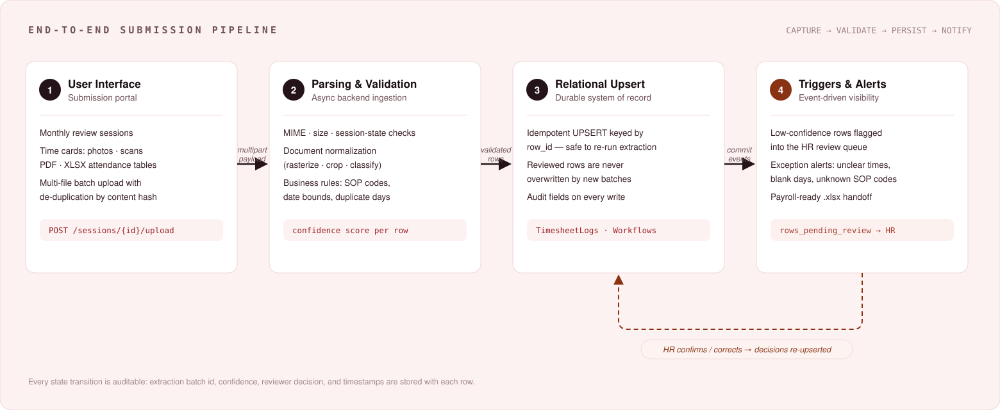
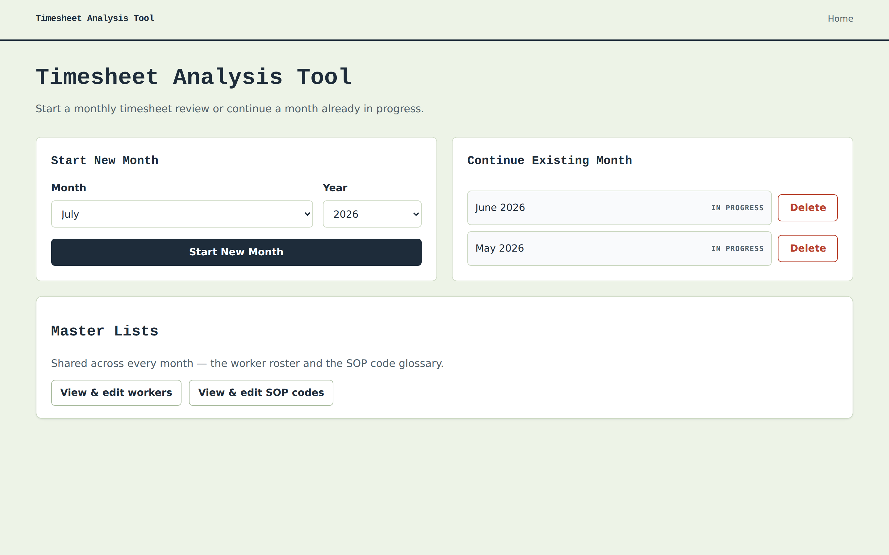
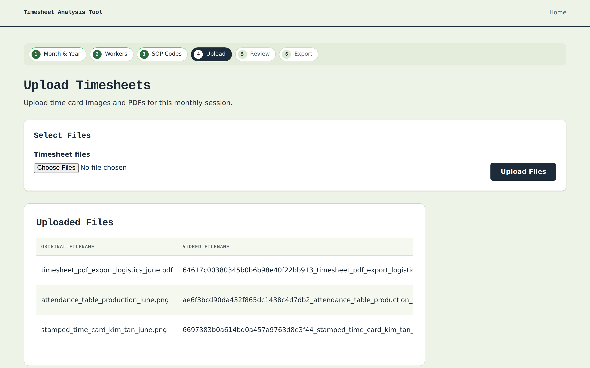
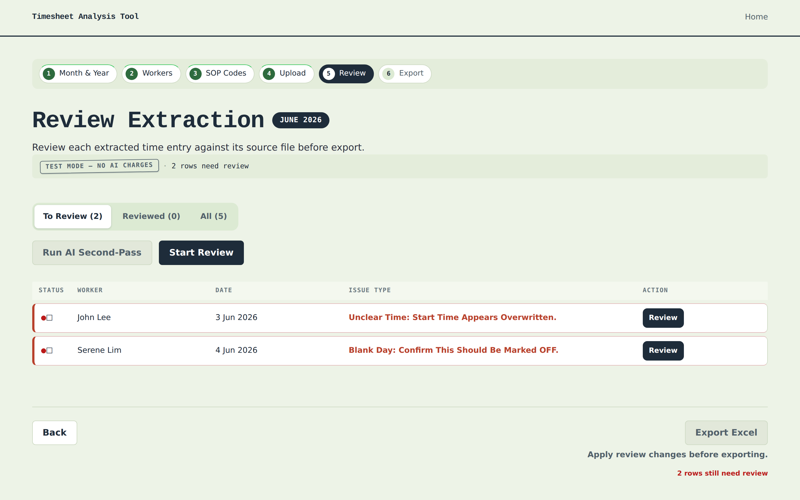
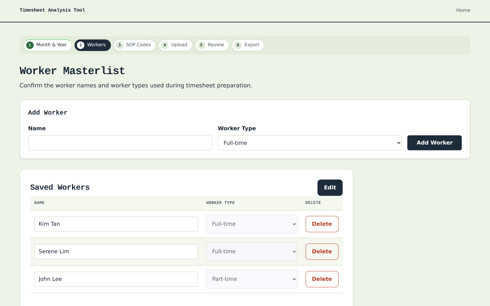
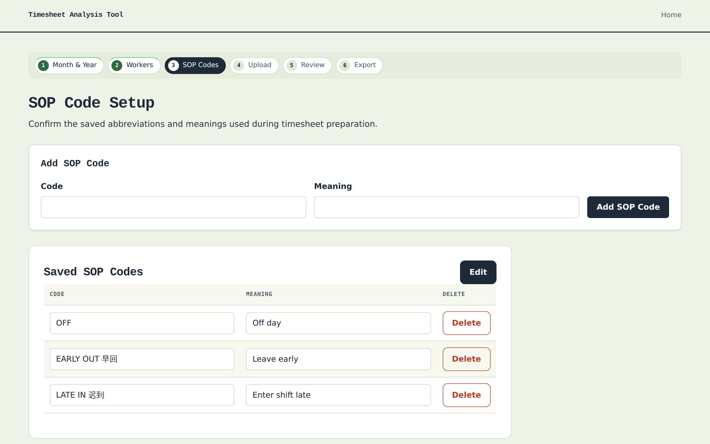

# HR Timesheet & Approval Tool

[](https://github.com/daetan999/hr_timesheet_tool/actions/workflows/ci.yml)
[](#overview)
[](#technical-design)
[](#public-portfolio-boundary)
[](LICENSE)
[](https://github.com/daetan999/technical_resume)

## Overview

This repository is a working public prototype for replacing paper and spreadsheet-based time capture with a structured review and payroll-export workflow.

The application covers document intake, field normalization, deterministic validation, exception review, reference-data management, and Excel export. The public extraction layer runs in mock mode so the complete workflow can be evaluated without external credentials or employee data.

## Public-Portfolio Boundary

- Employee records and sample submissions are synthetic.
- Production extraction providers, HRIS integrations, payroll endpoints, credentials, and internal routing rules are excluded or mocked.
- The file-backed public prototype is separated from the proposed production persistence design.
- Screenshots are rendered from sanitized application templates.

## End-to-End Workflow



1. Create a submission period.
2. Upload PDF, JPG, PNG, or HEIC files.
3. Normalize documents and convert extracted fields into structured rows.
4. Validate dates, duplicate entries, reference codes, hours, and confidence thresholds.
5. Route low-confidence and rule-breaking rows to an exception queue.
6. Allow an HR reviewer to confirm or correct flagged entries.
7. Preserve reviewed rows through idempotent updates and audit fields.
8. Export approved entries into a payroll-ready Excel workbook.

## Data Model


The target schema separates:

- Employees
- Submission periods
- Timesheet entries
- Approval workflows
- Reference and SOP codes

The public prototype uses file-backed stores shaped to map directly onto transactional SQL tables in a production implementation.

## Product Views

| Session dashboard | Document upload |
|---|---|
|  |  |

| Exception review | Worker masterlist |
|---|---|
|  |  |

| SOP code glossary |
|---|
|  |

## Technical Design

| Layer | Technology | Role |
|---|---|---|
| Runtime | Python 3.11+ | Validation, document processing, and export logic |
| API | FastAPI · Uvicorn | Request handling and application routes |
| UI | Jinja2 | Server-rendered review workflow without a frontend build step |
| Document processing | PyMuPDF · Pillow | PDF and image normalization |
| Extraction | Pluggable service boundary | Mocked publicly; replaceable in production |
| Persistence | File-backed relational-shaped stores | Public prototype with a documented SQL promotion path |
| Export | openpyxl | Payroll-ready Excel generation |
| Configuration | Environment variables · versioned reference data | Separation of secrets and operational configuration |

## Workflow Controls

- File type and size validation before processing
- Idempotent row identifiers to prevent duplicate inserts
- Explicit exception reasons for low-confidence or invalid entries
- Reviewed-data protection during subsequent updates
- Audit timestamps and approval status
- Payroll export restricted to approved records
- Mock mode as the default public configuration

## Production Extension Path

A production implementation could promote individual layers independently:

### Persistence and analytics

- Transactional PostgreSQL or managed SQL database
- Change-data-capture into BigQuery or Snowflake
- Overtime, labor-cost, and approval-SLA reporting
- Policy-based retention and audit snapshots

### Authentication and API governance

- OAuth2 or OIDC for reviewers
- Service credentials for system integrations
- API gateway rate limits and quotas
- Published OpenAPI contract and integration tests

### Event-driven processing

- Kafka or RabbitMQ for durable workflow events
- Independent notification workers
- Retry and dead-letter handling
- Real-time alerts for low-confidence rows and stalled approvals

These items are documented as extension paths and are not represented as implemented in the public prototype.

## Run Locally

```bash
python -m venv .venv
source .venv/bin/activate       # Windows: .venv\Scripts\activate
pip install -r requirements.txt
cp .env.example .env
uvicorn app:app --reload
```

The application starts at `http://127.0.0.1:8000`. Mock extraction is enabled by default.

## Verification

```bash
python -m compileall app.py services
python -m unittest discover -s tests -v
```

CI runs the same Python checks, validates the SVG assets, and verifies relative documentation links.

## License

Released under the [MIT License](LICENSE).

---

[Back to the AI Infrastructure Solutions Portfolio](https://github.com/daetan999/technical_resume)
